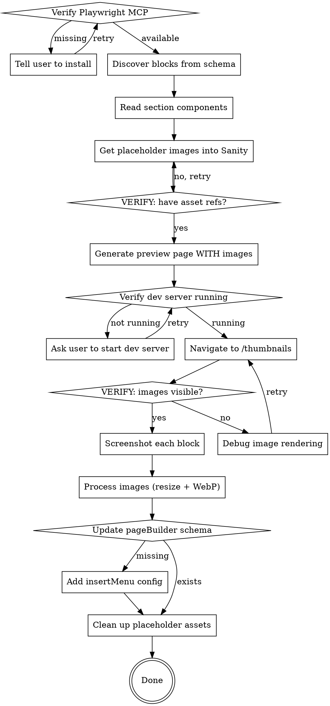

# Generate Sanity Studio Page Builder Thumbnails (Agentic)

## Overview

Fully agentic thumbnail generation for Sanity Studio's `insertMenu` grid view. You (Claude) read the schema, upload placeholder images to Sanity, generate a preview page with real asset references, use Playwright MCP to screenshot each block, process the images, and output optimized thumbnails. No scripts, no manual steps.

## Prerequisites

**STOP and check these before proceeding:**

1. **Playwright MCP is configured.** Run a Playwright MCP tool (e.g. `browser_navigate`) to verify. If unavailable, **STOP** and ask the user:

   > "This skill requires the Playwright MCP server for browser automation. Please run this command and restart Claude Code:"
   >
   > ```
   > claude mcp add playwright -- npx @playwright/mcp@latest
   > ```
   >
   > Do NOT proceed until the user confirms Playwright MCP is available.

2. **The project has a Sanity Studio** with page builder blocks (look for `schemaTypes/blocks/` or similar).

3. **The project has a Next.js frontend** that renders those blocks as section components.

4. **The dev server is running.** Check by curling `localhost:3000` (or the project's dev port). If not running, ask the user to start it before continuing.

5. **Sanity project credentials are available.** Find the `projectId` and `dataset` from `sanity.config.ts`, `sanity.cli.ts`, or environment variables. Also locate a write API token (check `.env` files for `SANITY_API_WRITE_TOKEN` or similar).

## Process



## Step 1: Discover Page Builder Blocks

Read the schema files to find all page builder block types:

1. Find the page builder definition (e.g. `schemaTypes/definitions/pagebuilder.ts`)
2. Find the blocks index that lists all types
3. Read each block schema to understand fields, types, and required vs optional

**Record for each block:**

- Schema type `name` (this becomes the thumbnail filename — must match exactly)
- All fields with types (string, text, image, richText, reference, array, etc.)
- **Which fields are image types** — mark these, they need real Sanity asset references
- Required vs optional fields

## Step 2: Read Frontend Components

Find the PageBuilder renderer and each section component:

1. Find the component mapping (which block type maps to which component)
2. Read each section component for:
   - Props interface (what data shape it expects)
   - Built-in default values
   - Whether it self-fetches from Sanity when no data is provided
   - **How it renders images** — find the `SanityImage` or image component. What exact prop shape does it expect? (Usually `{ _type: "image", asset: { _type: "reference", _ref: "image-xxx" }, alt: "text" }`)

## Step 3: Get Placeholder Images Into Sanity

<HARD-GATE>
DO NOT skip this step. DO NOT pass `null` for image fields. DO NOT use plain `` tags.
Blocks with image fields MUST have real Sanity image asset references so the `SanityImage` component renders actual images in the thumbnails.
If you skip this step, the thumbnails will be text-only and look incomplete.

**ALWAYS check for existing images in the dataset FIRST.** Most projects already have image assets — use those. Only suggest uploading new placeholders as a last resort, and ALWAYS ask the user for permission before writing to their dataset.
</HARD-GATE>

**3a. Check for existing images in the dataset first:**

Use the Sanity MCP `query_documents` tool. If the MCP is not authenticated (common error: "project user not found"), fall back to a direct API call using the project's read token:

```bash
curl -s -G "https://PROJECT_ID.api.sanity.io/v2024-01-01/data/query/DATASET" \
  -H "Authorization: Bearer READ_TOKEN" \
  --data-urlencode 'query=*[_type == "sanity.imageAsset"][0...5]{ _id, originalFilename, metadata { dimensions } }'
```

If images exist, use their `_id` values as asset references and skip to 3d.

**3b. If no images exist, download placeholders:**

```bash
curl -L -o /tmp/placeholder-landscape.jpg "https://picsum.photos/seed/thumb-land/800/600"
curl -L -o /tmp/placeholder-portrait.jpg "https://picsum.photos/seed/thumb-port/600/800"
curl -L -o /tmp/placeholder-square.jpg "https://picsum.photos/seed/thumb-sq/600/600"
```

**3c. Upload each image to Sanity (ASK USER FIRST):**

<HARD-GATE>
**ALWAYS ask the user before uploading anything to their Sanity dataset.** Do not upload images without explicit permission — the user may not want placeholder assets in their production dataset.
</HARD-GATE>

Find the projectId, dataset, and API token from the project config files. Then upload:

```bash
curl -s -X POST \
  "https://PROJECT_ID.api.sanity.io/v2024-01-01/assets/images/DATASET" \
  -H "Authorization: Bearer API_TOKEN" \
  -H "Content-Type: image/jpeg" \
  --data-binary @/tmp/placeholder-landscape.jpg
```

Replace `PROJECT_ID`, `DATASET`, and `API_TOKEN` with actual values from the project.

The response JSON contains the asset document. Extract the `_id` field — it looks like `image-<hash>-800x600-jpg`.

**Repeat for each placeholder image variant** (landscape, portrait, square).

**3d. VERIFY — you must have at least one working asset reference before continuing.**

Confirm by querying:

```groq
*[_type == "sanity.imageAsset"] | order(_createdAt desc) [0...3]{ _id }
```

You should get back `_id` values. These are your asset references.

**Store them as variables for Step 4:**

- `LANDSCAPE_REF` = `image-<hash>-800x600-jpg`
- `PORTRAIT_REF` = `image-<hash>-600x800-jpg`
- `SQUARE_REF` = `image-<hash>-600x600-jpg`

## Step 4: Generate the Preview Page

Create the preview page at the app router path (e.g. `apps/web/src/app/thumbnails/page.tsx`).

**Page structure:**

<HARD-GATE>
- **MUST be a client component** — add `"use client"` at the top of the file. Many section components use client-side libraries (e.g. `DynamicIcon` from `lucide-react/dynamic` with function props like `fallback`, Radix UI primitives, `useFormStatus`). These function props CANNOT be serialized across the React Server Component boundary. A server component page will throw: `"Functions cannot be passed directly to Client Components"`.
- Do NOT add a `process.env.NODE_ENV` guard — it's unreliable in Next.js dev mode and this page will be deleted after screenshots anyway.
</HARD-GATE>

- Import section components directly (NOT through PageBuilder which needs Visual Editing context)
- Wrap each block: `<div data-block="{schemaTypeName}">`
- `data-block` value MUST exactly match the schema type `name`
- Do NOT add `style={{ background: "#CCC" }}` to wrappers — it adds visual noise to thumbnails

**Mock data rules:**

- **Contextual lorem ipsum** — content that makes sense for each block's purpose:
  - Hero: compelling headline, persuasive subtext
  - CTA: action-oriented copy
  - FAQ: realistic questions with helpful answers
  - Features: distinct capabilities with clear descriptions
  - Newsletter: enticing signup copy
  - Portfolio/work: creative project descriptions

- **Rich text / Portable Text** — use inline block format:

  ```typescript
  [
    {
      _type: "block",
      _key: "k1",
      style: "normal",
      children: [{ _type: "span", _key: "s1", text: "Your text", marks: [] }],
      markDefs: [],
    },
  ];
  ```

- **Image fields — MANDATORY, do not pass null:**

  ```typescript
  image: {
    _type: "image",
    asset: {
      _type: "reference",
      _ref: "LANDSCAPE_REF_FROM_STEP_3"  // e.g. "image-abc123-800x600-jpg"
    },
    alt: "Placeholder image"
  }
  ```

  Use landscape refs for hero/banner images, portrait for profile/avatar images, square for card thumbnails.
  Every block that has an image field MUST receive a real asset reference.

- **Self-fetching components — MUST pass mock items directly:**
  Some components (e.g. work lists, archive lists, project grids) will self-fetch from Sanity when no items are passed. On a fresh project this results in empty lists — the thumbnail shows only the heading with nothing below it.

  **ALWAYS pass mock items directly as props.** Read the component source to find what fields each item needs. Typical pattern:

  ```typescript
  // WorkList / project grid — pass `projects` prop
  projects={[
    { _id: "p1", title: "Brand Identity Redesign", year: "2025",
      thumbnail: { _type: "image", asset: { _type: "reference", _ref: "LANDSCAPE_REF" } } },
    { _id: "p2", title: "E-Commerce Platform", year: "2024",
      thumbnail: { _type: "image", asset: { _type: "reference", _ref: "LANDSCAPE_REF" } } },
    { _id: "p3", title: "Mobile App Design", year: "2024",
      thumbnail: { _type: "image", asset: { _type: "reference", _ref: "LANDSCAPE_REF" } } },
    { _id: "p4", title: "Marketing Campaign", year: "2023",
      thumbnail: { _type: "image", asset: { _type: "reference", _ref: "LANDSCAPE_REF" } } },
  ]}

  // ArchiveList — pass `items` prop
  items={[
    { _id: "a1", title: "Gallery Website", year: "2023", role: "Lead Designer",
      client: "Studio Co", description: "A minimal portfolio site",
      thumbnail: { _type: "image", asset: { _type: "reference", _ref: "LANDSCAPE_REF" } } },
    { _id: "a2", title: "Dashboard UI", year: "2022", role: "UI Designer",
      client: "Tech Inc", description: "Analytics dashboard redesign",
      thumbnail: { _type: "image", asset: { _type: "reference", _ref: "LANDSCAPE_REF" } } },
  ]}
  ```

  Replace `LANDSCAPE_REF` with the actual asset reference from Step 3.
  Include enough items to make the grid look populated (3-4 for grids, 2-3 for lists).

- **Reference fields (non-self-fetching)** — pass inline objects with the fields the component reads (`_id`, `title`, etc.)

- **Buttons** — include 1-2 with contextual labels

- **`_type` fields on mock items** — every mock item in an array must include its `_type` field matching the schema type name. For example, FAQ items need `_type: "faq"`, feature card items need `_type: "featureCardIcon"`. Read the component's TypeScript props to find the required discriminant. Missing `_type` causes type errors and can break rendering.

- Use `any` casts or `@ts-expect-error` for type mismatches — this is dev-only

- Give each mock item unique `_key` values

## Step 5: Screenshot Each Block with Playwright MCP

**Ensure output directory exists:**

```bash
mkdir -p apps/studio/static/thumbnails
```

**Use Playwright MCP tools in sequence:**

1. **Set viewport:** Use `browser_resize` or navigate with a wide viewport (1440x900)
2. **Navigate:** `browser_navigate` to `http://localhost:3000/thumbnails`
3. **Wait for render:** Allow the page to fully load (wait for network idle or a brief pause)

<HARD-GATE>
4. **VERIFY IMAGES ARE VISIBLE:** Take a full-page screenshot first and visually inspect it. Look for:
   - Are images actually rendering in hero blocks, card blocks, about sections?
   - Or are there blank/broken image areas?

If images are NOT visible: STOP. Debug the issue. Common causes:

- Asset reference is wrong (check `_ref` value matches an actual `_id` from Sanity)
- Image component expects different prop shape than what you passed
- The dev server needs to be restarted to pick up the new page
- CORS issue with Sanity CDN (check browser console via Playwright)

DO NOT proceed to take individual screenshots until images are confirmed visible.
</HARD-GATE>

5. **For each block:**
   - Scroll to the `[data-block="{name}"]` element
   - Take a screenshot of that element using `browser_take_screenshot`
   - Save the screenshot to a temp location

## Step 6: Process Images

Output: **600x400** WebP thumbnails that show the **full width** of each block.

<HARD-GATE>
**DO NOT use `fit: 'cover'` or `force_original_aspect_ratio=increase` with a center crop.** Blocks render at 1440px wide but thumbnails are 600px wide. A cover-crop zooms in and clips the sides — titles get cut off, cards disappear, centered content becomes unrecognizable.

**CORRECT approach:** Scale width to 600px first (height proportional), THEN crop height to 400 max from top, padding with white if shorter. This preserves the full block layout.
</HARD-GATE>

**Option A — ffmpeg (preferred, commonly available on macOS/Linux):**

```bash
ffmpeg -y -i input.png \
  -vf "scale=600:-1:flags=lanczos,crop=600:min(ih\,400):0:0,pad=600:400:0:(oh-ih)/2:white" \
  -quality 85 output.webp
```

This pipeline:
1. Scales width to 600px (height proportional) — full block width preserved
2. Crops height to 400px from top if taller (captures header + key content)
3. Pads with white and centers vertically if shorter than 400px

**Option B — sharp (Node one-liner):**

```bash
node -e "require('sharp')('input.png').resize(600, null).extend({bottom: 400, background: 'white'}).resize(600, 400, {fit: 'cover', position: 'top'}).webp({quality:85}).toFile('output.webp')"
```

**Batch processing example (ffmpeg):**

```bash
for f in /tmp/thumbnails/*-raw.png; do
  name=$(basename "$f" -raw.png)
  ffmpeg -y -i "$f" \
    -vf "scale=600:-1:flags=lanczos,crop=600:min(ih\,400):0:0,pad=600:400:0:(oh-ih)/2:white" \
    -quality 85 "apps/studio/static/thumbnails/${name}.webp"
done
```

**Final output:** WebP files in `apps/studio/static/thumbnails/` named `{schemaTypeName}.webp`

## Step 7: Update pageBuilder Schema

Check the page builder schema definition for `insertMenu` config. If missing, add:

```typescript
options: {
  insertMenu: {
    views: [
      {
        name: "grid",
        previewImageUrl: (schemaTypeName) =>
          `/static/thumbnails/${schemaTypeName}.webp`,
      },
    ],
  },
},
```

The path must match where the processed thumbnails were saved.

## Step 8: Clean Up

**8a. Delete Playwright MCP console logs:**

Playwright MCP automatically creates a `.playwright-mcp/` directory with console log files (e.g. `console-2026-*.log`). Delete the directory after screenshots are complete:

```bash
rm -rf .playwright-mcp/
```

Also add `.playwright-mcp/` to `.gitignore` if not already present — these logs should never be committed.

**8b. Delete raw screenshot artifacts:**

After processing images to WebP in Step 6, immediately delete the raw screenshot files (e.g. `*-raw.jpeg` or `*-raw.png`) from the output directory. These are intermediate files and are no longer needed.

```bash
rm apps/studio/static/thumbnails/*-raw.jpeg
rm apps/studio/static/thumbnails/*-raw.png
```

Only the final `{schemaTypeName}.webp` files should remain in the thumbnails directory.

**8c. Delete the preview page:**

The `/thumbnails` preview page was only needed to render blocks for screenshotting. Delete it now that screenshots are complete:

```bash
rm -rf apps/web/src/app/thumbnails/
```

This removes both `page.tsx` and any wrapper files (e.g. `pet-wrapper.tsx`) created for the preview. Do NOT keep the preview page — it adds dead code to the project and can be regenerated by running this skill again if thumbnails need updating.

**8d. Ask about placeholder images (if uploaded):**

If you uploaded placeholder images to Sanity in Step 3 (i.e. no existing images were available), ask the user:

> "Thumbnails are done. I uploaded placeholder images to your Sanity dataset for the screenshots. Want me to delete them, or keep them for future use?"

If deleting, use the Sanity API or MCP tools to remove the uploaded assets by their `_id`.

If existing dataset images were used (Step 3a), skip this — nothing was uploaded.

## Common Mistakes

| Mistake                                           | Fix                                                                                               |
| ------------------------------------------------- | ------------------------------------------------------------------------------------------------- |
| **Cropping thumbnails with `fit: cover` (most common)** | **Scale width to 600 first, then crop/pad height. Cover-crop clips wide blocks.**           |
| **Preview page as server component**              | **MUST be `"use client"` — function props (DynamicIcon fallback, etc.) can't serialize across RSC boundary** |
| **Missing `_type` on mock array items**           | **Every mock item needs `_type` matching its schema name (e.g. `_type: "faq"`, `_type: "featureCardIcon"`)** |
| **Uploading to Sanity without asking**            | **ALWAYS ask user before writing to their dataset — use existing assets when possible**            |
| Skipping image upload when images needed          | NEVER pass `null` for image fields. Use existing Sanity assets or upload placeholders (with permission) |
| Filename doesn't match schema type name           | Use exact `name` from schema (e.g. `featureCardsIcon` not `feature-cards-icon`)                   |
| Using PageBuilder component                       | Import section components directly — PageBuilder needs Visual Editing context                     |
| Generic placeholder text                          | Write contextual copy matching each block's purpose                                               |
| Missing `_key` on array items                     | Every array item needs a unique `_key` string                                                     |
| Rich text as plain string                         | Must use Portable Text block format with `_type: "block"`                                         |
| Using `NODE_ENV` guard on preview page            | Unreliable in Next.js dev — page will be deleted anyway, skip the guard                           |
| Adding `style={{ background: "#CCC" }}` to wrappers | Adds visual noise to thumbnails — let blocks render with their own backgrounds                  |
| Sanity MCP not authenticated                      | Fall back to direct API calls with project read/write tokens from `.env` files                    |
| Playwright MCP not available                      | Run `claude mcp add playwright -- npx @playwright/mcp@latest` and restart Claude Code             |
| Dev server not running                            | Ask user to start it — don't try to launch it yourself                                            |
| Screenshots too large/small                       | Set viewport to 1440x900 before navigating, resize output to 600x400                              |
| Using plain `` for SanityImage fields        | Components expect Sanity image props — upload to Sanity and use asset refs                        |
| Taking screenshots before verifying images render | Always take a full-page screenshot first and visually confirm images are visible                  |
| Leaving raw screenshots (`*-raw.jpeg`) behind     | Delete all raw/intermediate files after processing to WebP — only `.webp` files should remain     |
| Leaving the preview page in the codebase          | Delete `app/thumbnails/` after screenshots are taken — it's dead code and easily regenerated      |

## Red Flags — STOP If You Notice These

- You're about to write `image: null` or `image={null}` — **STOP**, go back to Step 3
- You're about to use `` instead of SanityImage — **STOP**, that won't work with the component
- You're taking screenshots but haven't verified images are rendering — **STOP**, take a full-page screenshot first
- You're skipping Step 3 because "it's faster" — **STOP**, text-only thumbnails are incomplete
- The preview page renders but image areas are blank — **STOP**, debug the asset reference before screenshotting
- You're about to use `fit: 'cover'` or `force_original_aspect_ratio=increase` in image processing — **STOP**, this will clip wide blocks. Use scale-width-first approach.
- You're creating the preview page WITHOUT `"use client"` — **STOP**, function props in child components will crash the page
- You're about to upload images to Sanity without asking the user — **STOP**, check for existing assets first, and always ask permission before writing to their dataset
- You're passing mock items without `_type` fields — **STOP**, TypeScript discriminated unions require `_type` on every mock item
